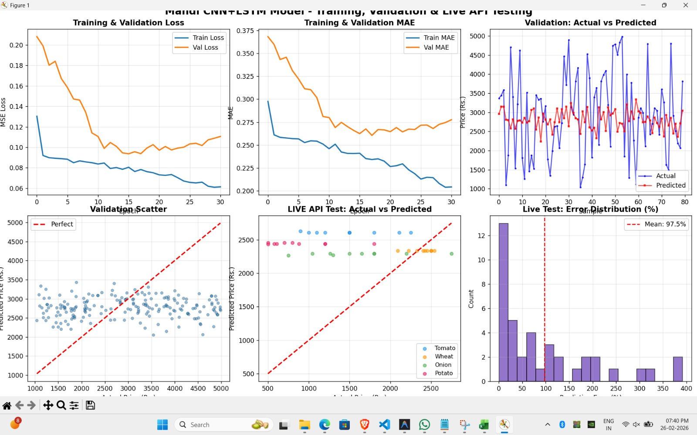

Problem Statement: India's farmers lose up to 40% of produce not due to poor farming, but poor timing and market mismatch. Build an AI system that ingests real weather patterns, soil health indicators, and historical mandi price data to recommend the optimal harvest window and best target market for a given crop and region. Beyond harvest, the system should assess post-harvest spoilage risk based on storage conditions and transit time, and suggest preservation actions ranked by cost and effectiveness. The solution must be designed for a farmer with a basic Android phone — outputs should be in plain language with minimal data literacy required. Accuracy matters, but so does trust: the system should show why it made a recommendation, not just what it recommends. 

Solution 💡
AI Agrivesta:

🌦 Real-time weather patterns
📈 Historical Mandi Price data

It then provides:

1. Best harvest timing recommendation
2. Market price prediction
3. Suggested selling window
4. Risk alerts (weather / price drop)

FEATURES ADDED TILL NOW:
## 🌦 Weather API Integration

The project now integrates real-time weather data using the Open-Meteo API.

### What was added:
- Fetches live temperature, rainfall, and humidity data
- Connects weather data to mandi price prediction input
- Improves prediction accuracy by including environmental factors

API Used:
https://open-meteo.com/

## 🌾 Mandi Price Forecasting Feature

### 📌 Mandi Price Prediction Module

This project includes a **time-series based Mandi Price Forecasting system** that predicts future commodity prices using deep learning models.

---

### 🔹 Key Functionalities

- 📂 Upload historical mandi price dataset (CSV format)
- 📊 Automatic preprocessing and normalization of price data
- 📈 Integrated mandi price calculation (average across multiple mandis per date)
- 🔄 Time-series sequence generation for model training
- 🤖 1D CNN / LSTM based model for price prediction
- 📉 Visualization of Actual vs Predicted Prices
- 🔮 Next-day / multi-day price forecasting

---

### 🧠 Model Used

The system uses a **1D Convolutional Neural Network (1D CNN)** for time-based training.

- Detects short-term price trends  
- Fast training (within 10 minutes)  
- Suitable for large historical datasets  

> ⚡ The model can be extended to LSTM or CNN + LSTM hybrid architecture for improved forecasting accuracy.

---

### 🏗 Model Architecture Diagram

### ⚙️ Technical Implementation

- Python  
- TensorFlow / Keras  
- Pandas & NumPy  
- Scikit-learn (MinMaxScaler)  
- Matplotlib for visualization  
- Google Colab compatible  

---

### 📊 Output

- Predicted future mandi price  
- Model evaluation using Mean Squared Error (MSE)  
- Graph comparing actual vs predicted prices

# 🌾 Agrivista – AI Powered Agricultural Market Intelligence

Agrivista is an AI-driven agricultural decision support platform that helps farmers make smarter selling, storage, and bargaining decisions using real-time mandi data, weather intelligence, and explainable AI insights.

---

## 🚀 Features

### 📊 Live Mandi Intelligence
- Real-time Agmarknet prices (Min, Max, Modal)
- Filter by state, commodity, and market
- Data-driven insights for better selling decisions

### 🤖 AI Market Chat (Explainable AI)
- Powered by Google Gemini 2.0 Flash
- Answers:
  - When to sell?
  - Where to sell?
  - Storage tips?
- Provides reasoning behind recommendations
- Multi-language conversational interface

### 💹 Smart Bargain Assistant
- Compares vendor price with mandi modal price
- Calculates exact markup %
- Suggests counter-offers with ready-to-use phrases
- Verdict:
  - Fair
  - Overpriced
  - Very Overpriced

### 🏭 Smart Godown (Storage Risk Advisor)
- Weather-based spoilage risk detection (Low / Medium / High)
- Ideal storage temperature & humidity guidance
- Shelf-life estimation
- Suggests cost-effective preservation actions
- Mentions relevant government schemes

### 🌤 Weather Integration
- Real-time temperature & humidity
- Direct integration into storage risk calculation

---

## 📈 How It Works

1. Fetch real-time mandi prices.
2. Integrate live weather data.
3. Run ML model for price prediction.
4. Generate explainable AI recommendations.
5. Assist farmers in selling, bargaining, and storage planning.

---

## 🎯 Vision

To reduce farmer losses caused by poor timing, market mismatch, and storage risks by delivering intelligent, real-time, and explainable agricultural insights.
