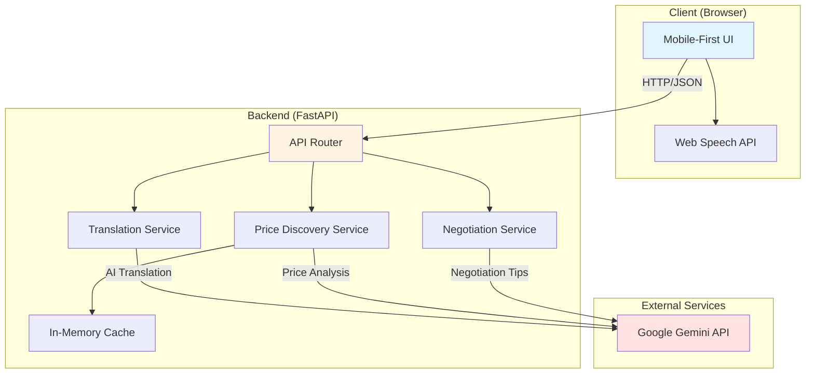
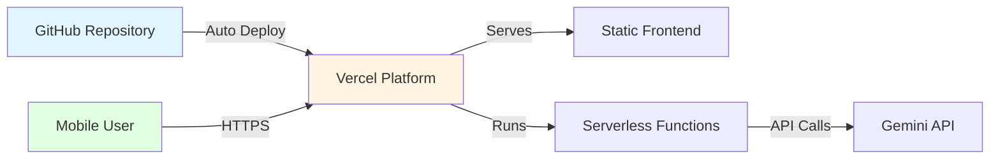

# Design Document: Multilingual Mandi

## Overview

Multilingual Mandi is a web-based platform that enables Indian market vendors to overcome language barriers, access real-time market prices, and receive AI-powered negotiation assistance. The system architecture follows a client-server model with a FastAPI backend and vanilla JavaScript frontend, optimized for mobile devices and rapid deployment on Vercel's free tier.

The platform integrates with Google's Gemini API for translation and intelligent price analysis, implements browser-based Web Speech API for voice input, and uses in-memory caching to minimize API costs while maintaining responsive performance.

### Key Design Principles

1. **Zero-Cost Infrastructure**: Leverage free-tier services (Vercel, Gemini API) exclusively
2. **Mobile-First**: Optimize for small screens and touch interactions
3. **Rapid Development**: Use vanilla JavaScript (no build tools) for quick iteration
4. **Resilient Integration**: Graceful degradation when external services fail
5. **Hackathon-Ready**: Modular code that multiple developers can work on simultaneously

## Architecture

### System Architecture



### Technology Stack

**Frontend:**
- Vanilla JavaScript (ES6+)
- HTML5 with semantic markup
- CSS3 with Flexbox/Grid for responsive layout
- Web Speech API for voice input
- Fetch API for HTTP requests

**Backend:**
- Python 3.11+
- FastAPI framework
- Pydantic for data validation
- Google Generative AI SDK (Gemini)
- In-memory dictionary for caching

**Deployment:**
- Vercel (serverless functions for backend)
- Static file serving for frontend
- Environment variables for API keys

### Deployment Architecture



## Components and Interfaces

### 1. Translation Service

**Responsibility:** Convert text between any pair of supported Indian languages using Gemini API.

**Interface:**
```python
class TranslationService:
    def translate(
        self,
        text: str,
        source_lang: str,
        target_lang: str
    ) -> TranslationResult:
        """
        Translate text from source language to target language.
        
        Args:
            text: The text to translate (non-empty)
            source_lang: Source language code (hi, en, ta, te, bn, mr)
            target_lang: Target language code (hi, en, ta, te, bn, mr)
            
        Returns:
            TranslationResult with translated text and metadata
            
        Raises:
            ValidationError: If text is empty or languages are invalid
            APIError: If Gemini API fails
            TimeoutError: If request exceeds 5 seconds
        """
```

**Key Methods:**
- `validate_language(lang: str) -> bool`: Check if language is supported
- `sanitize_input(text: str) -> str`: Clean and validate input text
- `call_gemini_api(prompt: str) -> str`: Make API request with retry logic
- `format_translation_prompt(text, source, target) -> str`: Create Gemini prompt

**Error Handling:**
- Rate limit exceeded: Return cached response or error message
- Network failure: Retry up to 3 times with exponential backoff
- Invalid response: Log error and return user-friendly message
- Timeout: Cancel request after 5 seconds

### 2. Voice Input Module

**Responsibility:** Capture spoken language using browser Web Speech API and convert to text.

**Interface:**
```javascript
class VoiceInputModule {
    constructor(language = 'hi-IN') {
        this.recognition = new webkitSpeechRecognition();
        this.language = language;
        this.isListening = false;
    }
    
    startListening(onResult, onError) {
        // Start capturing voice input
        // Call onResult(text) when speech is recognized
        // Call onError(error) if recognition fails
    }
    
    stopListening() {
        // Stop capturing voice input
    }
    
    isSupported() {
        // Check if Web Speech API is available
        return 'webkitSpeechRecognition' in window;
    }
}
```

**Language Mapping:**
- Hindi: `hi-IN`
- English: `en-IN`
- Tamil: `ta-IN`
- Telugu: `te-IN`
- Bengali: `bn-IN`
- Marathi: `mr-IN`

**Visual Feedback:**
- Listening: Pulsing red microphone icon
- Processing: Spinner animation
- Complete: Green checkmark
- Error: Red X with error message

### 3. Price Discovery Engine

**Responsibility:** Retrieve and cache market price information for commodities.

**Interface:**
```python
class PriceDiscoveryEngine:
    def get_price(
        self,
        commodity: str,
        language: str = 'en'
    ) -> PriceResult:
        """
        Get market price for a commodity.
        
        Args:
            commodity: Name of the commodity in any supported language
            language: Language for response formatting
            
        Returns:
            PriceResult with min, max, avg prices and timestamp
            
        Raises:
            NotFoundError: If commodity is not in database
            CacheError: If cache operation fails
        """
    
    def update_cache(self, commodity: str, price_data: dict) -> None:
        """Update cache with new price data."""
    
    def is_cache_fresh(self, commodity: str) -> bool:
        """Check if cached data is less than 6 hours old."""
```

**Price Data Structure:**
```python
class PriceResult:
    commodity: str
    min_price: float  # ₹/kg
    max_price: float  # ₹/kg
    avg_price: float  # ₹/kg
    last_updated: datetime
    source: str  # "cache" or "api"
```

**Caching Strategy:**
- Cache duration: 6 hours
- Cache key: `f"price:{commodity.lower()}"`
- Eviction policy: LRU (Least Recently Used)
- Max cache size: 100 entries

**Initial Price Database:**
The system will include a seed database with common commodities:
- Vegetables: Tomato, Onion, Potato, Cauliflower, Cabbage
- Fruits: Apple, Banana, Mango, Orange, Grapes
- Grains: Rice, Wheat, Dal (Lentils)

### 4. Negotiation Assistant

**Responsibility:** Analyze quoted prices and provide negotiation recommendations.

**Interface:**
```python
class NegotiationAssistant:
    def analyze_price(
        self,
        commodity: str,
        quoted_price: float,
        language: str = 'en'
    ) -> NegotiationResult:
        """
        Analyze a quoted price and provide recommendations.
        
        Args:
            commodity: Name of the commodity
            quoted_price: Price quoted by seller (₹/kg)
            language: Language for recommendations
            
        Returns:
            NegotiationResult with analysis and tips
        """
    
    def calculate_confidence(
        self,
        market_price: PriceResult,
        quoted_price: float
    ) -> int:
        """Calculate confidence score (0-100) for recommendation."""
    
    def generate_tips(
        self,
        analysis: dict,
        language: str
    ) -> list[str]:
        """Generate culturally appropriate negotiation tips."""
```

**Analysis Logic:**
```python
def classify_price(quoted: float, avg: float, min: float, max: float) -> str:
    if quoted < min:
        return "below_market"
    elif quoted > max:
        return "above_market"
    elif quoted <= avg:
        return "fair_low"
    else:
        return "fair_high"
```

**Confidence Score Calculation:**
- Data freshness: 40% weight (fresh data = higher confidence)
- Price deviation: 30% weight (closer to average = higher confidence)
- Market volatility: 30% weight (stable prices = higher confidence)

**Negotiation Tips Template:**
```python
TIPS_TEMPLATE = {
    "above_market": [
        "The quoted price is {percent}% above market average",
        "Suggest offering ₹{fair_price}/kg instead",
        "Mention that you've seen better prices at other stalls"
    ],
    "fair_low": [
        "This is a good price, within market range",
        "You can accept or try negotiating down slightly"
    ],
    # ... more templates
}
```

### 5. API Router

**Responsibility:** Route HTTP requests to appropriate services and handle CORS.

**Endpoints:**

```python
# Translation
POST /api/translate
Request: {
    "text": str,
    "source_lang": str,
    "target_lang": str
}
Response: {
    "translated_text": str,
    "source_lang": str,
    "target_lang": str,
    "timestamp": str
}

# Price Discovery
GET /api/price?commodity={name}&lang={code}
Response: {
    "commodity": str,
    "min_price": float,
    "max_price": float,
    "avg_price": float,
    "last_updated": str,
    "currency": "INR",
    "unit": "kg"
}

# Negotiation
POST /api/negotiate
Request: {
    "commodity": str,
    "quoted_price": float,
    "language": str
}
Response: {
    "analysis": str,
    "fair_price": float,
    "confidence_score": int,
    "tips": list[str],
    "price_comparison": {
        "quoted": float,
        "market_avg": float,
        "difference_percent": float
    }
}

# Health Check
GET /api/health
Response: {
    "status": "healthy",
    "timestamp": str,
    "services": {
        "gemini_api": "connected" | "error",
        "cache": "active"
    }
}
```

**CORS Configuration:**
```python
app.add_middleware(
    CORSMiddleware,
    allow_origins=["*"],  # Hackathon-friendly, restrict in production
    allow_methods=["GET", "POST"],
    allow_headers=["*"],
)
```

### 6. Frontend UI Components

**Responsibility:** Provide mobile-first interface for all platform features.

**Component Structure:**
```
index.html
├── Header (Language Selector)
├── Tab Navigation (Translate | Prices | Negotiate)
├── Translation Tab
│   ├── Source Language Selector
│   ├── Text Input Area
│   ├── Voice Input Button
│   ├── Target Language Selector
│   └── Translation Output
├── Price Discovery Tab
│   ├── Commodity Search Input
│   ├── Language Selector
│   └── Price Display Card
└── Negotiation Tab
    ├── Commodity Input
    ├── Quoted Price Input
    ├── Language Selector
    └── Recommendation Display
```

**Key UI Functions:**
```javascript
// Translation
async function translateText(text, sourceLang, targetLang) {
    // Call /api/translate
    // Update UI with result
}

function startVoiceInput(language) {
    // Initialize VoiceInputModule
    // Show recording indicator
}

// Price Discovery
async function searchPrice(commodity, language) {
    // Call /api/price
    // Display price card with min/max/avg
}

// Negotiation
async function getNegotiationHelp(commodity, quotedPrice, language) {
    // Call /api/negotiate
    // Display analysis and tips
}

// Utility
function showLoading(element) {
    // Show spinner
}

function showError(message, element) {
    // Display error message
}
```

**Responsive Breakpoints:**
- Mobile: < 768px (default)
- Tablet: 768px - 1024px
- Desktop: > 1024px (optional enhancement)

## Data Models

### Translation Models

```python
from pydantic import BaseModel, Field, validator
from datetime import datetime

class TranslationRequest(BaseModel):
    text: str = Field(..., min_length=1, max_length=5000)
    source_lang: str = Field(..., regex="^(hi|en|ta|te|bn|mr)$")
    target_lang: str = Field(..., regex="^(hi|en|ta|te|bn|mr)$")
    
    @validator('text')
    def text_not_empty(cls, v):
        if not v.strip():
            raise ValueError('Text cannot be empty or whitespace only')
        return v.strip()
    
    @validator('target_lang')
    def languages_different(cls, v, values):
        if 'source_lang' in values and v == values['source_lang']:
            raise ValueError('Source and target languages must be different')
        return v

class TranslationResponse(BaseModel):
    translated_text: str
    source_lang: str
    target_lang: str
    timestamp: datetime
    cached: bool = False
```

### Price Models

```python
class PriceRequest(BaseModel):
    commodity: str = Field(..., min_length=1, max_length=100)
    language: str = Field(default='en', regex="^(hi|en|ta|te|bn|mr)$")
    
    @validator('commodity')
    def normalize_commodity(cls, v):
        return v.strip().lower()

class PriceData(BaseModel):
    commodity: str
    min_price: float = Field(..., gt=0)
    max_price: float = Field(..., gt=0)
    avg_price: float = Field(..., gt=0)
    last_updated: datetime
    source: str = Field(default='cache')
    
    @validator('max_price')
    def max_greater_than_min(cls, v, values):
        if 'min_price' in values and v < values['min_price']:
            raise ValueError('Max price must be >= min price')
        return v
    
    @validator('avg_price')
    def avg_in_range(cls, v, values):
        if 'min_price' in values and 'max_price' in values:
            if not (values['min_price'] <= v <= values['max_price']):
                raise ValueError('Average must be between min and max')
        return v

class PriceResponse(BaseModel):
    commodity: str
    min_price: float
    max_price: float
    avg_price: float
    last_updated: str
    currency: str = "INR"
    unit: str = "kg"
```

### Negotiation Models

```python
class NegotiationRequest(BaseModel):
    commodity: str = Field(..., min_length=1, max_length=100)
    quoted_price: float = Field(..., gt=0)
    language: str = Field(default='en', regex="^(hi|en|ta|te|bn|mr)$")
    
    @validator('commodity')
    def normalize_commodity(cls, v):
        return v.strip().lower()

class PriceComparison(BaseModel):
    quoted: float
    market_avg: float
    difference_percent: float
    classification: str  # "above_market", "below_market", "fair_low", "fair_high"

class NegotiationResponse(BaseModel):
    analysis: str
    fair_price: float
    confidence_score: int = Field(..., ge=0, le=100)
    tips: list[str] = Field(..., min_items=2)
    price_comparison: PriceComparison
    data_freshness_warning: str | None = None
```

### Cache Models

```python
from dataclasses import dataclass
from datetime import datetime, timedelta

@dataclass
class CacheEntry:
    key: str
    value: dict
    timestamp: datetime
    ttl: timedelta = timedelta(hours=6)
    
    def is_fresh(self) -> bool:
        return datetime.now() - self.timestamp < self.ttl
    
    def age_hours(self) -> float:
        return (datetime.now() - self.timestamp).total_seconds() / 3600

class InMemoryCache:
    def __init__(self, max_size: int = 100):
        self.cache: dict[str, CacheEntry] = {}
        self.max_size = max_size
        self.access_order: list[str] = []  # For LRU
    
    def get(self, key: str) -> dict | None:
        if key in self.cache and self.cache[key].is_fresh():
            self._update_access(key)
            return self.cache[key].value
        elif key in self.cache:
            del self.cache[key]  # Remove stale entry
        return None
    
    def set(self, key: str, value: dict) -> None:
        if len(self.cache) >= self.max_size:
            self._evict_lru()
        self.cache[key] = CacheEntry(key, value, datetime.now())
        self._update_access(key)
    
    def _evict_lru(self) -> None:
        if self.access_order:
            lru_key = self.access_order.pop(0)
            del self.cache[lru_key]
    
    def _update_access(self, key: str) -> None:
        if key in self.access_order:
            self.access_order.remove(key)
        self.access_order.append(key)
```

## Correctness Properties

*A property is a characteristic or behavior that should hold true across all valid executions of a system—essentially, a formal statement about what the system should do. Properties serve as the bridge between human-readable specifications and machine-verifiable correctness guarantees.*


### Property Reflection

After analyzing all acceptance criteria, I've identified the following redundancies and consolidations:

**Redundancies Identified:**
1. Properties 1.1 and 1.3 both test translation across language pairs - can be combined into one comprehensive property
2. Properties 3.1 and 3.2 both test price query responses - timestamp check can be part of the main price query property
3. Properties 4.1 and 4.2 both test price comparison - classification is part of the comparison logic
4. Properties 8.2 and 8.3 both test cache behavior - timestamp storage is implied by freshness checking

**Consolidated Properties:**
- Translation completeness: Test all language pairs return valid translations (combines 1.1, 1.3)
- Price query completeness: Test all price responses include required fields including timestamp (combines 3.1, 3.2)
- Price classification: Test comparison and classification together (combines 4.1, 4.2)
- Cache freshness: Test cache serves fresh data without API calls, which requires timestamps (combines 8.2, 8.3)

### Properties

**Property 1: Translation Language Pair Completeness**

*For any* valid text input and any pair of supported languages (Hindi, English, Tamil, Telugu, Bengali, Marathi), the Translation_System should successfully translate the text from source to target language and return a non-empty translated result.

**Validates: Requirements 1.1, 1.3**

---

**Property 2: Whitespace Input Rejection**

*For any* string composed entirely of whitespace characters (spaces, tabs, newlines), the Translation_System should reject the translation request and return an error message.

**Validates: Requirements 1.5**

---

**Property 3: Translation Error Language Consistency**

*For any* translation request that results in an API error, the error message returned should be in the same language as the source language of the request.

**Validates: Requirements 1.4**

---

**Property 4: API Response Validation**

*For any* API response received from external services, the Translation_System should validate the response structure before processing, and reject malformed responses with appropriate error handling.

**Validates: Requirements 7.3, 7.4**

---

**Property 5: Price Query Response Completeness**

*For any* valid commodity query in any supported language, the Price_Discovery_Engine should return a price result containing minimum price, maximum price, average price, and a last_updated timestamp.

**Validates: Requirements 3.1, 3.2**

---

**Property 6: Price Range Invariant**

*For any* price data returned by the Price_Discovery_Engine, the following invariant must hold: min_price ≤ avg_price ≤ max_price.

**Validates: Requirements 3.1**

---

**Property 7: Unknown Commodity Error Handling**

*For any* commodity name that does not exist in the price database, the Price_Discovery_Engine should return an error message indicating the commodity was not found, rather than returning invalid price data.

**Validates: Requirements 3.3**

---

**Property 8: Cache Consistency**

*For any* commodity, when queried multiple times within the cache TTL period (6 hours), the Price_Discovery_Engine should return identical price data for all queries.

**Validates: Requirements 3.5**

---

**Property 9: Cache Freshness Serving**

*For any* cached price data that is still fresh (less than 6 hours old), the Price_Discovery_Engine should serve it directly without making external API calls.

**Validates: Requirements 8.2, 8.3**

---

**Property 10: LRU Cache Eviction**

*For any* sequence of cache operations that exceeds the maximum cache size, the cache should evict the least recently used entry first, maintaining the most recently accessed entries.

**Validates: Requirements 8.4**

---

**Property 11: Price Classification Correctness**

*For any* quoted price and market price data, the Negotiation_Assistant should correctly classify the quoted price as "below_market" (< min), "above_market" (> max), "fair_low" (≥ min and ≤ avg), or "fair_high" (> avg and ≤ max).

**Validates: Requirements 4.1, 4.2**

---

**Property 12: Negotiation Response Language Consistency**

*For any* negotiation request in a specific supported language, all text in the response (analysis, tips, warnings) should be in that same language.

**Validates: Requirements 4.3**

---

**Property 13: Fair Price Suggestion Reasonableness**

*For any* quoted price that is above the market average, the suggested fair price should be between the market minimum and the quoted price, and closer to the market average than the quoted price.

**Validates: Requirements 5.1**

---

**Property 14: Confidence Score Range**

*For any* negotiation recommendation, the confidence score should be an integer between 0 and 100 (inclusive).

**Validates: Requirements 5.3**

---

**Property 15: Minimum Tips Count**

*For any* negotiation query, the response should include at least 2 distinct negotiation tips.

**Validates: Requirements 5.4**

---

### Example-Based Test Cases

These are specific scenarios that should be tested with concrete examples rather than property-based testing:

**Example 1: Voice Input Visual Feedback**
- When voice input is activated, verify the UI shows a pulsing red microphone icon
- When voice input completes, verify the input field is populated with captured text
- **Validates: Requirements 2.3, 2.5**

**Example 2: Web Speech API Unavailability**
- When Web Speech API is not supported by the browser, verify an appropriate message is displayed
- **Validates: Requirements 2.4**

**Example 3: Commodity Category Support**
- Test that at least one vegetable (e.g., "tomato"), one fruit (e.g., "apple"), and one grain (e.g., "rice") return valid price data
- **Validates: Requirements 3.4**

**Example 4: Gemini API Fallback**
- When Gemini API is unavailable, verify the Negotiation_Assistant still provides basic mathematical price comparison
- **Validates: Requirements 4.5**

**Example 5: Stale Data Warning**
- When cached price data is older than 24 hours, verify the negotiation response includes a data freshness warning
- **Validates: Requirements 5.5**

**Example 6: Mobile Responsive Design**
- Verify that on screen widths below 768px, the layout uses mobile-optimized styles
- Verify all interactive elements are at least 44x44px for touch targets
- **Validates: Requirements 6.1, 6.2**

**Example 7: Device Orientation Change**
- When device orientation changes from portrait to landscape, verify the layout adapts appropriately
- **Validates: Requirements 6.4**

**Example 8: Rate Limit Error Handling**
- When Gemini API returns a rate limit error, verify a user-friendly error message is displayed
- **Validates: Requirements 7.1**

**Example 9: Network Failure Detection**
- When network connectivity is lost during an API call, verify the system detects the failure and informs the user
- **Validates: Requirements 7.2**

**Example 10: Request Timeout**
- When an API request takes longer than 5 seconds, verify the request is cancelled and a timeout error is returned
- **Validates: Requirements 7.5**

**Example 11: Cache Duration**
- Fetch price data for a commodity, verify it's cached, wait 6 hours, verify the cache entry is considered stale
- **Validates: Requirements 8.1**

**Example 12: Vercel Configuration**
- Verify vercel.json exists and contains correct routing rules for /api/* paths
- Verify environment variable placeholders are defined
- **Validates: Requirements 9.1, 9.2, 9.3, 9.5**

**Example 13: Documentation Existence**
- Verify README.md exists and contains setup instructions and API documentation
- **Validates: Requirements 10.3**

**Example 14: Vanilla JavaScript Verification**
- Verify package.json (if exists) does not include build tools like webpack, vite, or parcel
- Verify frontend uses vanilla JavaScript without framework dependencies
- **Validates: Requirements 10.5**

## Error Handling

### Error Categories

**1. Validation Errors (400 Bad Request)**
- Empty or whitespace-only input text
- Invalid language codes
- Source and target languages are the same
- Negative or zero prices
- Missing required fields

**Response Format:**
```json
{
    "error": "validation_error",
    "message": "Descriptive error message in user's language",
    "field": "field_name",
    "code": "EMPTY_TEXT" | "INVALID_LANGUAGE" | "SAME_LANGUAGE" | "INVALID_PRICE"
}
```

**2. External Service Errors (502 Bad Gateway)**
- Gemini API unavailable
- Gemini API rate limit exceeded
- Gemini API returns malformed response
- Network connectivity issues

**Response Format:**
```json
{
    "error": "service_error",
    "message": "Service temporarily unavailable, please try again",
    "service": "gemini_api",
    "code": "API_UNAVAILABLE" | "RATE_LIMIT" | "MALFORMED_RESPONSE"
}
```

**3. Timeout Errors (504 Gateway Timeout)**
- Request exceeds 5-second timeout
- Gemini API response too slow

**Response Format:**
```json
{
    "error": "timeout_error",
    "message": "Request timed out, please try again",
    "timeout_seconds": 5
}
```

**4. Not Found Errors (404 Not Found)**
- Commodity not in price database
- Invalid API endpoint

**Response Format:**
```json
{
    "error": "not_found",
    "message": "Commodity not found in price database",
    "commodity": "requested_commodity_name",
    "code": "COMMODITY_NOT_FOUND"
}
```

**5. Cache Errors (500 Internal Server Error)**
- Cache operation fails
- Cache corruption detected

**Response Format:**
```json
{
    "error": "cache_error",
    "message": "Internal caching error, data fetched directly",
    "fallback": "direct_api_call"
}
```

### Error Handling Strategies

**Retry Logic:**
```python
async def call_with_retry(
    func: Callable,
    max_retries: int = 3,
    backoff_factor: float = 2.0
) -> Any:
    """
    Call a function with exponential backoff retry.
    
    Retry delays: 1s, 2s, 4s
    """
    for attempt in range(max_retries):
        try:
            return await func()
        except (NetworkError, TimeoutError) as e:
            if attempt == max_retries - 1:
                raise
            delay = backoff_factor ** attempt
            await asyncio.sleep(delay)
```

**Graceful Degradation:**
- Translation: If Gemini fails, return error (no fallback - translation requires AI)
- Price Discovery: If API fails but cache exists, serve stale cache with warning
- Negotiation: If Gemini fails, use basic mathematical comparison without AI tips

**Error Logging:**
```python
import logging

logger = logging.getLogger("multilingual_mandi")

# Log all errors with context
logger.error(
    "Translation failed",
    extra={
        "source_lang": source_lang,
        "target_lang": target_lang,
        "text_length": len(text),
        "error_type": type(e).__name__,
        "error_message": str(e)
    }
)
```

## Testing Strategy

### Dual Testing Approach

The testing strategy combines **unit tests** for specific examples and edge cases with **property-based tests** for universal correctness properties. Both are essential and complementary:

- **Unit tests** verify specific scenarios, edge cases, and integration points
- **Property tests** verify universal properties hold across many generated inputs

### Property-Based Testing Configuration

**Library Selection:**
- Python backend: **Hypothesis** (mature, well-documented, excellent for Python)
- JavaScript frontend: **fast-check** (lightweight, no build tools required)

**Test Configuration:**
```python
# Python (Hypothesis)
from hypothesis import given, settings
import hypothesis.strategies as st

@settings(max_examples=100)  # Minimum 100 iterations
@given(
    text=st.text(min_size=1, max_size=1000),
    source_lang=st.sampled_from(['hi', 'en', 'ta', 'te', 'bn', 'mr']),
    target_lang=st.sampled_from(['hi', 'en', 'ta', 'te', 'bn', 'mr'])
)
def test_translation_property(text, source_lang, target_lang):
    """
    Feature: multilingual-mandi, Property 1: Translation Language Pair Completeness
    
    For any valid text input and any pair of supported languages,
    translation should return a non-empty result.
    """
    # Test implementation
```

```javascript
// JavaScript (fast-check)
const fc = require('fast-check');

fc.assert(
    fc.property(
        fc.string({ minLength: 1, maxLength: 1000 }),
        fc.constantFrom('hi', 'en', 'ta', 'te', 'bn', 'mr'),
        fc.constantFrom('hi', 'en', 'ta', 'te', 'bn', 'mr'),
        async (text, sourceLang, targetLang) => {
            // Feature: multilingual-mandi, Property 1: Translation Language Pair Completeness
            // Test implementation
        }
    ),
    { numRuns: 100 } // Minimum 100 iterations
);
```

### Test Organization

**Backend Tests (Python):**
```
tests/
├── unit/
│   ├── test_translation_service.py
│   ├── test_price_discovery.py
│   ├── test_negotiation_assistant.py
│   └── test_cache.py
├── property/
│   ├── test_translation_properties.py
│   ├── test_price_properties.py
│   ├── test_negotiation_properties.py
│   └── test_cache_properties.py
├── integration/
│   ├── test_api_endpoints.py
│   └── test_gemini_integration.py
└── conftest.py  # Shared fixtures
```

**Frontend Tests (JavaScript):**
```
tests/
├── unit/
│   ├── test_voice_input.js
│   ├── test_ui_components.js
│   └── test_api_client.js
├── property/
│   └── test_ui_properties.js
└── integration/
    └── test_e2e_flows.js
```

### Property Test Coverage

Each correctness property from the design document must have a corresponding property-based test:

| Property | Test File | Test Function |
|----------|-----------|---------------|
| Property 1: Translation Language Pair Completeness | test_translation_properties.py | test_all_language_pairs_translate |
| Property 2: Whitespace Input Rejection | test_translation_properties.py | test_whitespace_rejection |
| Property 3: Translation Error Language Consistency | test_translation_properties.py | test_error_language_consistency |
| Property 4: API Response Validation | test_translation_properties.py | test_api_response_validation |
| Property 5: Price Query Response Completeness | test_price_properties.py | test_price_response_completeness |
| Property 6: Price Range Invariant | test_price_properties.py | test_price_range_invariant |
| Property 7: Unknown Commodity Error Handling | test_price_properties.py | test_unknown_commodity_error |
| Property 8: Cache Consistency | test_cache_properties.py | test_cache_consistency |
| Property 9: Cache Freshness Serving | test_cache_properties.py | test_cache_freshness |
| Property 10: LRU Cache Eviction | test_cache_properties.py | test_lru_eviction |
| Property 11: Price Classification Correctness | test_negotiation_properties.py | test_price_classification |
| Property 12: Negotiation Response Language Consistency | test_negotiation_properties.py | test_response_language |
| Property 13: Fair Price Suggestion Reasonableness | test_negotiation_properties.py | test_fair_price_suggestion |
| Property 14: Confidence Score Range | test_negotiation_properties.py | test_confidence_score_range |
| Property 15: Minimum Tips Count | test_negotiation_properties.py | test_minimum_tips_count |

### Unit Test Coverage

Unit tests should focus on:

1. **Specific Examples**: Concrete test cases with known inputs/outputs
2. **Edge Cases**: Boundary conditions, empty inputs, maximum values
3. **Error Conditions**: Specific error scenarios from Example-Based Test Cases
4. **Integration Points**: API endpoint behavior, database interactions
5. **UI Interactions**: Button clicks, form submissions, voice input

**Example Unit Test:**
```python
def test_translate_hindi_to_english():
    """Test specific Hindi to English translation."""
    service = TranslationService()
    result = service.translate(
        text="नमस्ते",
        source_lang="hi",
        target_lang="en"
    )
    assert result.translated_text.lower() in ["hello", "namaste", "greetings"]
    assert result.source_lang == "hi"
    assert result.target_lang == "en"
```

### Test Data Generators

**Hypothesis Strategies for Property Tests:**
```python
import hypothesis.strategies as st

# Language strategy
supported_languages = st.sampled_from(['hi', 'en', 'ta', 'te', 'bn', 'mr'])

# Text strategy (non-empty)
valid_text = st.text(
    alphabet=st.characters(blacklist_categories=['Cs', 'Cc']),
    min_size=1,
    max_size=1000
)

# Whitespace-only text strategy
whitespace_text = st.text(
    alphabet=st.sampled_from([' ', '\t', '\n', '\r']),
    min_size=1,
    max_size=100
)

# Commodity strategy
commodities = st.sampled_from([
    'tomato', 'onion', 'potato', 'apple', 'banana',
    'rice', 'wheat', 'dal'
])

# Price strategy (positive floats)
prices = st.floats(min_value=1.0, max_value=1000.0, allow_nan=False)

# Price range strategy (min <= avg <= max)
@st.composite
def price_ranges(draw):
    min_price = draw(st.floats(min_value=1.0, max_value=100.0))
    max_price = draw(st.floats(min_value=min_price, max_value=200.0))
    avg_price = draw(st.floats(min_value=min_price, max_value=max_price))
    return {
        'min_price': min_price,
        'max_price': max_price,
        'avg_price': avg_price
    }
```

### Mocking Strategy

**Mock External Services:**
```python
from unittest.mock import Mock, patch
import pytest

@pytest.fixture
def mock_gemini_api():
    """Mock Gemini API for testing without actual API calls."""
    with patch('google.generativeai.GenerativeModel') as mock:
        mock_model = Mock()
        mock_model.generate_content.return_value.text = "Mocked translation"
        mock.return_value = mock_model
        yield mock

def test_translation_with_mock(mock_gemini_api):
    """Test translation using mocked Gemini API."""
    service = TranslationService()
    result = service.translate("Hello", "en", "hi")
    assert result.translated_text == "Mocked translation"
```

**Mock Web Speech API:**
```javascript
// Mock for testing voice input
class MockSpeechRecognition {
    constructor() {
        this.onresult = null;
        this.onerror = null;
    }
    
    start() {
        // Simulate successful recognition
        setTimeout(() => {
            if (this.onresult) {
                this.onresult({
                    results: [[{ transcript: 'test input' }]]
                });
            }
        }, 100);
    }
    
    stop() {}
}

window.webkitSpeechRecognition = MockSpeechRecognition;
```

### Continuous Testing

**Pre-commit Hooks:**
```bash
# .git/hooks/pre-commit
#!/bin/bash
echo "Running tests before commit..."
python -m pytest tests/ -v
if [ $? -ne 0 ]; then
    echo "Tests failed. Commit aborted."
    exit 1
fi
```

**GitHub Actions (Optional for hackathon):**
```yaml
name: Tests
on: [push, pull_request]
jobs:
  test:
    runs-on: ubuntu-latest
    steps:
      - uses: actions/checkout@v2
      - uses: actions/setup-python@v2
        with:
          python-version: '3.11'
      - run: pip install -r requirements.txt
      - run: pytest tests/ -v
```

### Test Execution Commands

```bash
# Run all tests
pytest tests/ -v

# Run only property tests
pytest tests/property/ -v

# Run only unit tests
pytest tests/unit/ -v

# Run with coverage
pytest tests/ --cov=src --cov-report=html

# Run specific property test
pytest tests/property/test_translation_properties.py::test_all_language_pairs_translate -v
```

## Deployment Guide

### Prerequisites

1. **GitHub Account**: For repository hosting
2. **Vercel Account**: For deployment (free tier)
3. **Google AI Studio Account**: For Gemini API key

### Environment Variables

Create a `.env` file (not committed to git):
```bash
GEMINI_API_KEY=your_api_key_here
ENVIRONMENT=production
CACHE_MAX_SIZE=100
CACHE_TTL_HOURS=6
```

### Vercel Configuration

**vercel.json:**
```json
{
  "version": 2,
  "builds": [
    {
      "src": "api/**/*.py",
      "use": "@vercel/python"
    },
    {
      "src": "public/**",
      "use": "@vercel/static"
    }
  ],
  "routes": [
    {
      "src": "/api/(.*)",
      "dest": "/api/$1"
    },
    {
      "src": "/(.*)",
      "dest": "/public/$1"
    }
  ],
  "env": {
    "GEMINI_API_KEY": "@gemini_api_key"
  }
}
```

### Project Structure

```
multilingual-mandi/
├── api/
│   ├── __init__.py
│   ├── main.py              # FastAPI app
│   ├── translation.py       # Translation service
│   ├── pricing.py           # Price discovery service
│   ├── negotiation.py       # Negotiation assistant
│   ├── cache.py             # Cache implementation
│   └── models.py            # Pydantic models
├── public/
│   ├── index.html           # Main UI
│   ├── styles.css           # Styling
│   ├── app.js               # Frontend logic
│   └── voice.js             # Voice input module
├── tests/
│   ├── unit/
│   ├── property/
│   └── integration/
├── .env.example             # Environment variable template
├── .gitignore
├── requirements.txt         # Python dependencies
├── vercel.json              # Vercel configuration
└── README.md                # Documentation
```

### Deployment Steps

1. **Push to GitHub:**
```bash
git init
git add .
git commit -m "Initial commit"
git remote add origin https://github.com/username/multilingual-mandi.git
git push -u origin main
```

2. **Connect to Vercel:**
- Go to vercel.com
- Click "Import Project"
- Select GitHub repository
- Add environment variable: `GEMINI_API_KEY`
- Click "Deploy"

3. **Verify Deployment:**
```bash
curl https://your-project.vercel.app/api/health
```

### Performance Optimization

**Caching Headers:**
```python
@app.get("/api/price")
async def get_price(response: Response):
    response.headers["Cache-Control"] = "public, max-age=21600"  # 6 hours
    # ... rest of implementation
```

**Compression:**
```python
from fastapi.middleware.gzip import GZipMiddleware

app.add_middleware(GZipMiddleware, minimum_size=1000)
```

**Static Asset Optimization:**
- Minify CSS (optional for hackathon)
- Use system fonts (no web font loading)
- Inline critical CSS
- Lazy load non-critical JavaScript

### Monitoring and Debugging

**Health Check Endpoint:**
```python
@app.get("/api/health")
async def health_check():
    return {
        "status": "healthy",
        "timestamp": datetime.now().isoformat(),
        "services": {
            "gemini_api": await check_gemini_connection(),
            "cache": "active"
        }
    }
```

**Logging:**
```python
import logging

logging.basicConfig(
    level=logging.INFO,
    format='%(asctime)s - %(name)s - %(levelname)s - %(message)s'
)
```

**Vercel Logs:**
```bash
vercel logs your-project.vercel.app
```
